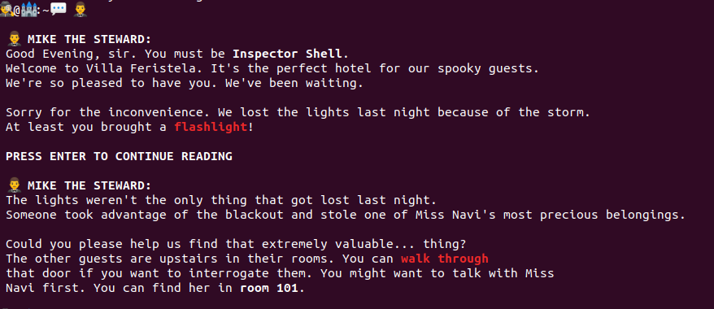

## Tuenti Challenge 10

This repo has the code for all challenges from 1-16.
All that had coding are in go, except for problem 14 which was easier in Node.

Each problem is a module (either go or node), in order to set it up:

Go:

    go get

Node:
    
    yarn

All programs accept the input through stdin and output the result to stdout (plus the log to stderr). So executing them is just:

    cat testInput.txt | go run main.go > testOutput.txt
    

Parsing of the input is annotation based using this [library](https://github.com/furstenheim/challenge_encoding).


### Problems
### Problem 1. Rock paper scissors.

First problem was straightforward. Since there are only 9 cases we can just hardcode them.

### Problem 2. Strongest player
There is a list of players (we don't know how many) with a hidden strength. We are provided a list of matches and need to find out the strongest player.

Since they are completely ordered, and we want to find the maximum, we can just discard everybody that lost at least one match.
At the end, we pick up the one that hasn't lose any.
It could potentially mean that there are two people that have never lost, but that is just bad input, because in that case we don't have enough information.

### Problem 3. Galdos
Third problem provides us with a copy of "Fortunata y Jacinta", and we need to be able to know the number of occurrences of each word, and it's total ranking.

We proceed in three phases. 

First, we need to clean up the book of all punctuation. For example, if the word is "Hello!" we are interested in "hello". Since the book is not extremely large, we can simply load it as a string and apply a regex:

```go
func parseBook (in string) string {
	lowerString := strings.ToLower(in)
	re := regexp.MustCompile(`[^abcdefghijklmnñopqrstuvwxyzáéíóúü]`)
	spacedString := re.ReplaceAll([]byte(lowerString), []byte(" "))
	return string(spacedString)
}
```

Second, we count words. We are asked to ignore words that have less than 3 letters. The tricky part is that we are dealing with unicode. For example, `él` is encoded with three bytes `C3 A9 6C` but it is only length two. With go this is straightforward using runes:

```go
word := "él"
realLength := len([]rune("él"))
realLength == 2
```

Third we order them, taking into account that we have to use unicode order.

### Problem 4. Steam
In this problem we need to access the pre-production environment of a certain game company.
Pre-production is sitting inside a VPN, so we cannot access directly. However, the load balancer of production has access, so we need to trick the load balancer (NGINX) to allow us to access.

For me, this was definitely the hardest problem of the first part. After trying tons of different combinations, I finally came to the one that worked:

```
curl steam-origin.contest.tuenti.net:9876/games/cat_fight/get_key?url=http://pre.steam-origin.contest.tuenti.net:9876/games/cat_fight/get_key  -H "Host: pre.steam-origin.contest.tuenti.net:9876"
```

With the host header, we trick nginx (not really nginx but the faulty configuration) to direct us to the environment that we want. Validation is probably checking that the url matches, so what we do is adding a query param with the pre.steam-origin url. Name of the query param doesn't matter. It could've been:


```
curl steam-origin.contest.tuenti.net:9876/games/cat_fight/get_key?another-parameter=http://pre.steam-origin.contest.tuenti.net:9876/games/cat_fight/get_key  -H "Host: pre.steam-origin.contest.tuenti.net:9876"
```


### Problem 5. Tuenti numbers
For this problem, we are requested to decompose a number into smaller numbers that contain the word "twenty", the more the merrier. For example, `43 == 23 + 20`.

At first, the problem looks a bit daunting, do we need to parse the English name of every single number up to 2<sup>62</sup>? However, it is much simpler than that. Every possible "tuenti" number is either "2[0-9]" or bigger than 1000, which can be decomposed into sums of "2[0-9]". Since 20 is the smallest one, we should prefer it, and leave the rest for higher numbers. That is, `61 == 20 + 20 + 20 + 1 = 20 + 20 + 21`

### Problem 6. Princess
I liked this problem a lot. We had to reach the princess, only through knight hops. The tricky part is that we didn't have the whole map, but only a visible 3x3 around us, which was provided through a TCP socket.

First, I tried a BFS (also known as every possible combination) but it was taking too long, and the server was cutting the connection.

A simple version of A* worked out nicely. We know that the princess is in position (0, 1), so we need to prioritize movements that take us to the center. For example, if we are in coordinates (-5, -10) we should try first U2R1 and U1R2, rather than D1L2 which takes us further away from the princess.

After 1000! hops and 10 minutes we arrive to the princess.

### Problem 7. Decrypting
A simple problem to relax after the previous one. We receive an encrypted message using simple substitution encryption. Numbers have not been replaced and we are given the clue that it is related to Dvorak (the music is his).

With that we have enough to start. `(8 o.ly.mx.p 1841  1 maf 1904)` we know that he was born the 8th of November and died the 1st of May, so `o->n`, `.->o` and so on. Maybe, it can be done automatically, but by looking at the words that start to be readable is easy to find the mapping of symbols

### Problem 8. Code in the code
Not super hard, but you have to find it. By reading at the image raw binary, you find something at the end that looks like brainfuck.

    cat image.png | less image.png
    
    ++++++++++[>++++++>+++++++>++++++++>+++>+<<<<<-]>>>++++.<++.---.>>++.<<--.>-----.<+.+.>>.<<++++.>++++.<<--.>>>.<++++.<++++++.---.+++.---.+++.>>+..
    
Pasting that to a brainfuck executor finds the result

### Problem 9. Cylons
We are given some input, the encryption and the code that encrypts. We need to unencrypt some text.

The key part of the encryption script is:

    crpt_chr=$(( $asc_chr ^ ${key_char} ))

we are doing simple xor encryption. We know that `a^a = 0`, `a^b = b^a`, and `(a^b)^c = a ^ (b^c)`. If `m` is the initial message, `k` is the key. The encrypted messsage is `m^k`. Similarly, we need to unencrypt `n` and we have `n^k`, so we do `result = n = (n ^ k) ^ k = (n ^ k ) ^ (m ^ (m ^k))`. In code this is:

```javascript
  const firstPlanet = Buffer.from('514;248;980;347;145;332')
  const firstMessage = Buffer.from('3633363A33353B393038383C363236333635313A353336','hex')
  const secondMessage = Buffer.from('3A3A333A333137393D39313C3C3634333431353A37363D', 'hex')
  const decrypted = xor(xor(firstMessage, firstPlanet), secondMessage).toString() 
```

### Problem 10. Escape from the castle
This problem was very neat. A text adventure on the shell using emojis



Not super hard once you realized that most of them were standard bash commands. Walking (🚶) was `cd`, flashlight (🔦) was `ls`. For example, the ghost cannot find its ring, we find it with `🔦 -a` since it is a hidden file. Similarly, the robot wants to know its exit code, so we can do `$?`.

### Problem 11


