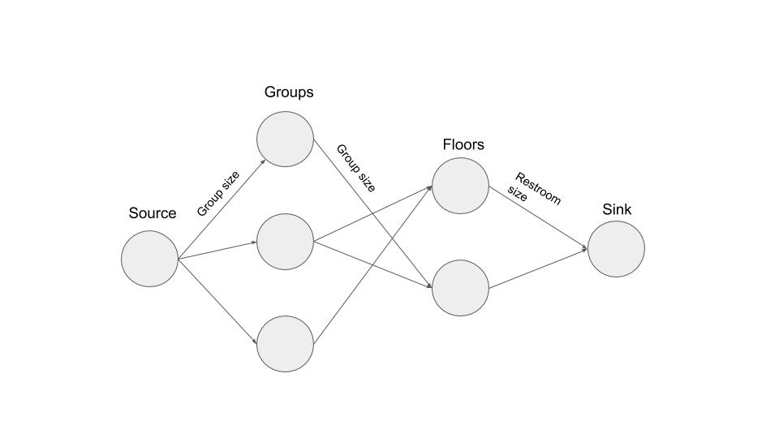

## Tuenti Challenge 10

This repo has the code for all challenges from 1-16.
All that had coding are in go, except for problem 14 which was easier in Node.

Each problem is a module (either go or node), in order to set it up:

Go:

    go get

Node:
    
    yarn

All programs accept the input through stdin and output the result to stdout (plus the log to stderr). So executing them is just:

    cat testInput.txt | go run main.go > testOutput.txt
    

Parsing of the input is annotation based using this [library](https://github.com/furstenheim/challenge_encoding).


### Problems
### Problem 1. Rock paper scissors.

First problem was straightforward. Since there are only 9 cases we can just hardcode them.

### Problem 2. Strongest player
There is a list of players (we don't know how many) with a hidden strength. We are provided a list of matches and need to find out the strongest player.

Since they are completely ordered, and we want to find the maximum, we can just discard everybody that lost at least one match.
At the end, we pick up the one that hasn't lose any.
It could potentially mean that there are two people that have never lost, but that is just bad input, and we wouldn't have enough information.

### Problem 3. Galdos
Third problem provides us with a copy of "Fortunata y Jacinta", and we need to be able to know the number of occurrences of each word, and it's total ranking.

We proceed in three phases. 

First, we need to clean up the book of all punctuation. For example, if the word is "Hello!" we are interested in "hello". Since the book is not extremely large, we can simply load it as a string and apply a regex:

```go
func parseBook (in string) string {
	lowerString := strings.ToLower(in)
	re := regexp.MustCompile(`[^abcdefghijklmnñopqrstuvwxyzáéíóúü]`)
	spacedString := re.ReplaceAll([]byte(lowerString), []byte(" "))
	return string(spacedString)
}
```

Second, we count words. We are asked to ignore words that have less than 3 letters. The tricky part is that we are dealing with unicode. For example, `él` is encoded with three bytes `C3 A9 6C` but it is only length two. With go this is straightforward using runes:

```go
word := "él"
realLength := len([]rune("él"))
realLength == 2
```

Third we order them, taking into account that we have to use unicode order.

### Problem 4. Steam
In this problem we need to access the pre-production environment of a certain game company.
Pre-production is sitting inside a VPN, so we cannot access directly. However, the load balancer of production has access, so we need to trick the load balancer (NGINX) to allow us to access.


For me, this was definitely the hardest problem of the first part. After trying tons of different combinations, I finally came to the one that worked:

```
curl steam-origin.contest.tuenti.net:9876/games/cat_fight/get_key?url=http://pre.steam-origin.contest.tuenti.net:9876/games/cat_fight/get_key  -H "Host: pre.steam-origin.contest.tuenti.net:9876"
```

With the host header, we trick nginx (not really nginx but the faulty configuration) to direct us to the environment that we want. Validation is probably checking that the url matches, so what we do is adding a query param with the pre.steam-origin url. Name of the query param doesn't matter. It could've been:


```
curl steam-origin.contest.tuenti.net:9876/games/cat_fight/get_key?another-parameter=http://pre.steam-origin.contest.tuenti.net:9876/games/cat_fight/get_key  -H "Host: pre.steam-origin.contest.tuenti.net:9876"
```


### Problem 5. Tuenti numbers
For this problem, we are requested to decompose a number into smaller numbers that contain the word "twenty", the more the merrier. For example, `43 == 23 + 20`.

At first, the problem looks a bit daunting, do we need to parse the English name of every single number up to 2<sup>62</sup>? However, it is much simpler than that. Every possible "tuenti" number is either "2[0-9]" or bigger than 1000, which can be decomposed into sums of "2[0-9]". Since 20 is the smallest one, we should prefer it, and leave the rest for higher numbers. That is, `61 == 20 + 20 + 20 + 1 = 20 + 20 + 21`

### Problem 6. Princess
I liked this problem a lot. We had to reach the princess, only through knight hops. The tricky part is that we didn't have the whole map, but only a visible 3x3 around us, which was provided through a TCP socket.

First, I tried a BFS (also known as every possible combination) but it was taking too long, and the server was cutting the connection.

A simple version of A* worked out nicely. We know that the princess is in position (0, 1), so we need to prioritize movements that take us to the center. For example, if we are in coordinates (-5, -10) we should try first U2R1 and U1R2, rather than D1L2 which takes us further away from the princess.

After 1000! hops and 10 minutes we arrive to the princess.

### Problem 7. Decrypting
A simple problem to relax after the previous one. We receive an encrypted message using simple substitution encryption. Numbers have not been replaced and we are given the clue that it is related to Dvorak (the music is his).

With that we have enough to start. `(8 o.ly.mx.p 1841  1 maf 1904)` we know that he was born the 8th of November and died the 1st of May, so `o->n`, `.->o` and so on. Maybe, it can be done automatically, but by looking at the words that start to be readable is easy to find the mapping of symbols

### Problem 8. Code in the code
Not super hard, but you have to find it. By reading at the image raw binary, you find something at the end that looks like brainfuck.

    cat image.png | less image.png
    
    ++++++++++[>++++++>+++++++>++++++++>+++>+<<<<<-]>>>++++.<++.---.>>++.<<--.>-----.<+.+.>>.<<++++.>++++.<<--.>>>.<++++.<++++++.---.+++.---.+++.>>+..
    
Pasting that to a brainfuck executor finds the result

### Problem 9. Cylons
We are given some input, the encryption and the code that encrypts. We need to unencrypt some text.

The key part of the encryption script is:

    crpt_chr=$(( $asc_chr ^ ${key_char} ))

we are doing simple xor encryption. We know that `a^a = 0`, `a^b = b^a`, and `(a^b)^c = a ^ (b^c)`. If `m` is the initial message, `k` is the key. The encrypted messsage is `m^k`. Similarly, we need to unencrypt `n` and we have `n^k`, so we do `result = n = (n ^ k) ^ k = (n ^ k ) ^ (m ^ (m ^k))`. In code this is:

```javascript
  const firstPlanet = Buffer.from('514;248;980;347;145;332')
  const firstMessage = Buffer.from('3633363A33353B393038383C363236333635313A353336','hex')
  const secondMessage = Buffer.from('3A3A333A333137393D39313C3C3634333431353A37363D', 'hex')
  const decrypted = xor(xor(firstMessage, firstPlanet), secondMessage).toString() 
```

### Problem 10. Escape from the castle
This problem was very neat. A text adventure on the shell using emojis


Not super hard once you realized that most of them were standard bash commands. Walking (🚶) was `cd`, flashlight (🔦) was `ls`. For example, the ghost cannot find its ring, we find it with `🔦 -a` since it is a hidden file. Similarly, the robot wants to know its exit code, so we can do `$?`.

### Problem 11. Sums
For this problem we need to decompose a number into sums, but some numbers are forbidden. For example, we want to decompose 4, but 2 is forbidden. We can do:

``` 
4 == 1 + 1 + 1 + 1
4 == 1 + 3
```

We are not interested in permutations of the same combination, so `1 + 1 + 2` is the same as `2 + 1 + 1`.

For this problem, we can proceed incrementally. First we compute all the numbers that we can compute with 1s, then 2s... until n - 1, ignoring those that are forbidden.

So, what numbers can be computed with 3s, for example? First, all that are multiples of 3: 3, 6, 9... We can combine each of these with each previous combination. So if 4 was 1 + 1 + 1 +1, 1 + 1 + 2 and 2+ 2, we have 7 is each of those + 3, 10 is each of those plus 3 + 3....

In total we have an algorithm that is O(n<sup>3</sup>), which is acceptable given the conditions.

### Problem 12. RSA

In this problem we are given two plain texts and their encryption in RSA without padding. From that we need to find the "modulus". If we take a look at the [wikipedia article](https://en.wikipedia.org/wiki/RSA_(cryptosystem)#Encryption) we see that encryption is: 


Where `m` is the plain text, `e` is a constant, normally 65537, `c` is the encrypted text and `n` is the modulus that we are looking for. That means that m<sub>1</sub><sup>e</sup> - c<sub>1</sub> = λ<sub>1</sub>n where λ<sub>1</sub> is some integer. We can do that for both texts and obtain  λ<sub>1</sub>n, λ<sub>2</sub>n, if we compute the GCD, it will be a multiple of n, ideally n. Code is pretty straightforward:

```go
	m1 := getBig("plaintexts/test1.txt")
	m2 := getBig("plaintexts/test2.txt")
	c1 := getBig("ciphered/test1.txt")
	c2 := getBig("ciphered/test2.txt")
	e := big.NewInt(65537)
	m1.Exp(m1, e, nil)
	m2.Exp(m2, e, nil)
	m1.Sub(m1, c1)
	m2.Sub(m2, c2)
	m1.GCD(nil, nil, m1, m2)
	log.Println(m1)
```

with `getBig` defined as:


```go 
func getBig (file string) *big.Int {
	m1, _ := ioutil.ReadFile(file)
	m1b := big.NewInt(0)
	m1b.SetBytes(m1)
	return m1b
}
```

### Problem 13. Toilet paper castle
For this problem we need to build the highest and biggest (in that order) toilet paper with toilet paper rolls. Given some constraints.

Step 1: Start with the central tower. It must be at least three packs tall. From the top, it will be seen as either a square or a rectangle. If it's a rectangle, the difference between the two dimensions can only be one pack.

Step 2: Surround the previous packs, by making a new rectangular layer. This layer must have a height of two packs less than the previous one.

Step 3: Surround again, this time with a rectangular layer that is one pack taller than the previous one (one pack shorter than the layer that the previous step surrounded).

Step 4: If the last layer was two packs tall (which means that step 3’s layer was only one pack tall), you have finished. Otherwise, repeat steps 2 to 4.


First thing is to find a closed formula for the castle. We have three inputs, width, length and height. If we relax the rules a little bit, the smallest castle, would have just the central tower of height two.


In this case width is 2, length is 6 and height 2, we get a castle of size 2 x 6 x 2 which is 24.

The next possible castle, with the same width and length (of the central tower) is  


This is 2 x 6 x 3 for the center, 20 x 1 for the thin layer and 28 x 2 for the outer layer, 112 rolls in total. It is hard to see how it relates with the previous level.
 
 We can do the following trick. From the first castle, we add a layer of level 2 and size two more
 
 
 
 then we lower, everything but the outer layer one level, and we get the castle that we want. In formula this is:
 
 ```6 x 2 x 2 + 2 (6 + 4 ) x ( 2 + 4) - (6 + 2) (2 + 2)``` 

If we want to raise the castle one more level, it would be the same thing:

 ```6 x 2 x 2 + 2 (6 + 4 ) x ( 2 + 4) - (6 + 2) (2 + 2) + 2 (6 + 8 ) x ( 2 + 8) - (6 + 6) (2 + 6)``` 

The general formula would be:


If we expand all the multiplications and use the [formula](https://brilliant.org/wiki/sum-of-n-n2-or-n3/) for the sum numbers and the sum of squares, we get the following closed formula:


where s is the height minus 2. If we apply the formula to the previous case it would be m = 6, n = 2, s = 1 we get 112 again.

Once we have a closed formula the problem is easy. For a given height, the smallest castle is the one with width and length equal to 1. We find the biggest height such that this castle can be built with the provided rolls. Once we know the height, we find maximum width and length that can be built. The performance is `O(log height)`

### Problem 14. Paxos

For this problem we connect through TCP to a server where the paxos protocol is implemented https://en.wikipedia.org/wiki/Paxos_(computer_science)

Praxos is a protocol for distributed programming, so when we connect we see that there are several servers. Praxos has two parts, first we send a "PREPARE" message to one of the servers, where we request the serve to listen to us. Then we send an "ACCEPT" message with the actual message.

In the following message, we (server 9) tell server 3 to prepare to request 1.
```
PREPARE {1,9} -> 3
```

Server 3 can either return `3 -> PROMISE {1,9} no_proposal` if it's ready or `PROMISE_DENIAL {1,9} {6,5}`, which means that it had received id 6 from server 5.

Once we have promises, we send an accept message 
```
ACCEPT {id: {1,9}, value: {servers: [2,3,4,5,6,7,8,9], secret_owner: 3}} -> 2
```
This one tells the server 2 the new list of servers (we removed server 1) and the secret owner.

In order to get the secret we need to change the secret owner, but we get "NOT TRUSTWORTHY", to get around that, we open other tcp connections, we add those servers and once we have the majority we change the secret owner.

## Problem 15. DNA

We need to compute the CRC32 of sparse files, that is mostly null bytes and a couple of additions. CRC32 is mostly defined by taking mod in GF(2)[x]. Simplifying, a file with n  0 bits and a 1 in the first position would be: x<sup>n</sup>. If we want to compute a file with 2n zeros it would be mod (x<sup>2n</sup>) = mod (mod (x<sup>n</sup>) mod (x<sup>n</sup>)), which converts a problem linear on the size of the file into `O(log n)`.

The more difficult part here is that this is actually not true, we need a bit of preparation before the actual division. Once that is done it is easy to implement.
1. Reverse the bits
2. Xor the first digits with 0xFFFFFFFF
3. Pad with four bytes
4. Perform the division

## Problem 16. Restrooms

For this problem we have several groups of workers. Each group of worker can access certain floors of the building, and we need to provide the least possible number of restrooms so that everybody can go at the same time.


 
We can represent the problem with a flow chart. We have one node per group, one node per floor. Each group is connected to the floors it has access to. Additionally, we add a source that points to each group and a sink that every floor connects to. The sides from floor to sink have the capacity of the restrooms.

With that graph, the max flow is the maximum amount of people that we can fit at the same time. And we just need to adjust restroom size to the minimum possible value
